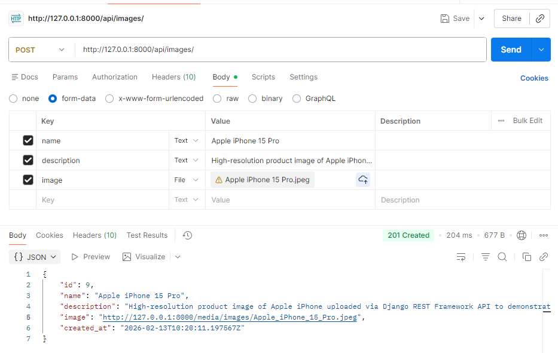
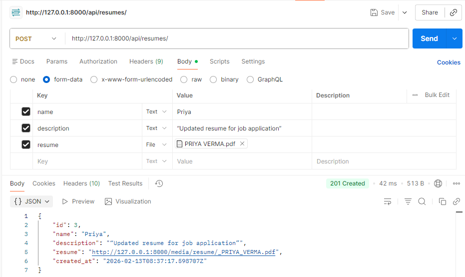

# 🗂 Django REST File Upload Project

This project demonstrates a **Django REST Framework** API for uploading and managing files (images and resumes) with proper storage and retrieval.

---

## 📌 Features

- Upload **images** and **resumes** via API or browser
- Browse uploaded files using **Django Browsable API**
- Retrieve file list and file details
- Supports **POST, GET, PATCH, DELETE** operations
- Proper media storage in `media/` folder
- Filter uploaded files by `name`
- Fully documented API with screenshots

---

## ⚙️ Installation

1. Clone the repository:

git clone https://github.com/srashtisikarwar/django-fileupload-api.git
cd fileupload

# Create a virtual environment
python -m venv env

# Activate environment
source env/bin/activate      # Linux / macOS
env\Scripts\activate         # Windows

# Install dependencies
pip install -r requirements.txt

# Apply migrations
python manage.py makemigrations
python manage.py migrate

# Run server
python manage.py runserver

📁 Folder Structure
project_root/
│
├── upload/               # Django app
│   ├── models.py
│   ├── views.py
│   └── serializers.py
│
├── media/                # Uploaded files
│   ├── images/
│   └── resumes/
│
├── screenshots/          # Project screenshots
│   ├── browser/
│   └── postman/
│
├── manage.py
└── README.md

🚀 Usage
1️⃣ Browser Upload

Go to Django Browsable API page:

http://127.0.0.1:8000/api/images/
http://127.0.0.1:8000/api/resumes/
Use the HTML form to upload files.

Uploaded files will be stored in:

media/images/
media/resumes/

2️⃣ API Upload (Postman)
Endpoint for Images:
POST http://127.0.0.1:8000/api/images/

Endpoint for Resumes:
POST http://127.0.0.1:8000/api/resumes/

Body → form-data:

Key	Type	Example
name	Text	iPhone 15 Pro
description	Text	High-resolution product image uploaded via API
image	File	choose image file
Sample JSON Response:

{
    "id": 9,
    "name": "Apple iPhone 15 Pro",
    "description": "High-resolution product image of Apple iPhone uploaded via Django REST Framework API to demonstrate image upload, media storage handling, and retrieval using list and detail endpoints",
    "image": "http://127.0.0.1:8000/media/images/Apple_iPhone_15_Pro.jpeg",
    "created_at": "2026-02-13T10:20:11.197567Z"
}

## 📸 API Testing Screenshots

### 🌐 Browser Testing (Django Browsable API)

#### API Root

#### Image List

#### Resume List

#### Resume Detail

---

### 🧪 Postman Testing

#### Image Upload (POST)

#### Resume Upload (POST)

#### Resume List

#### Image List
