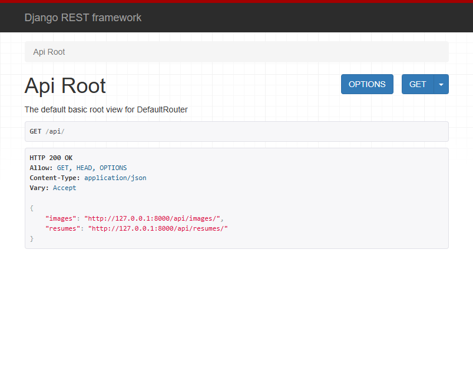
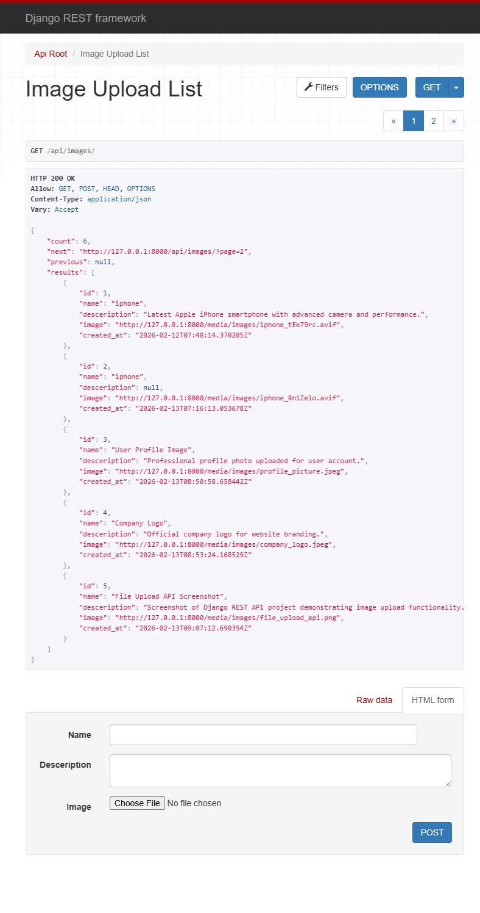
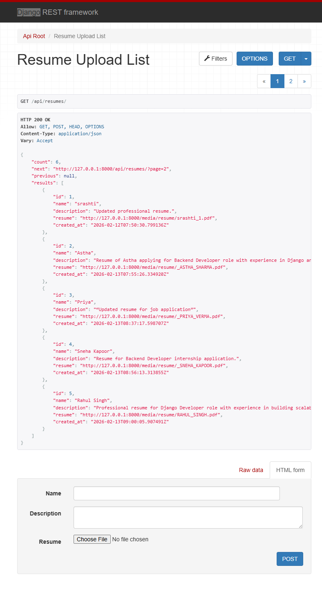
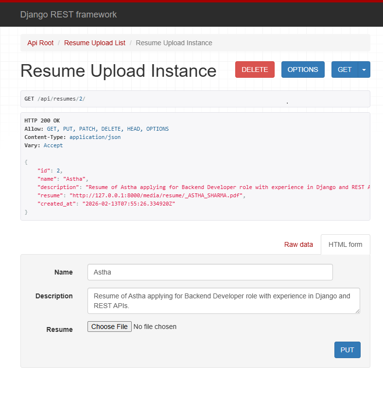
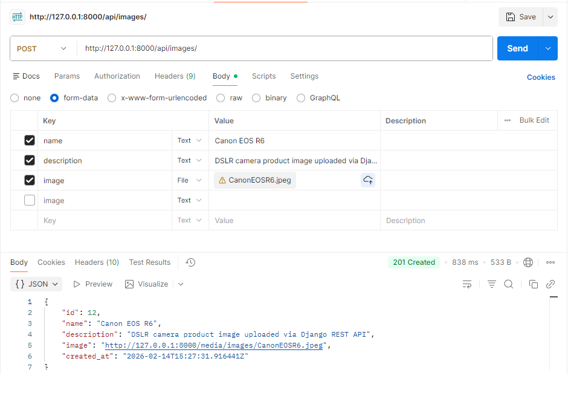
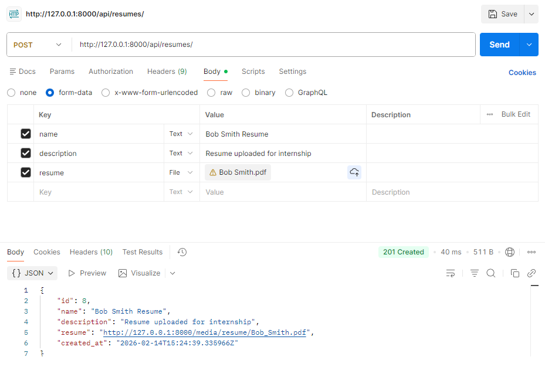
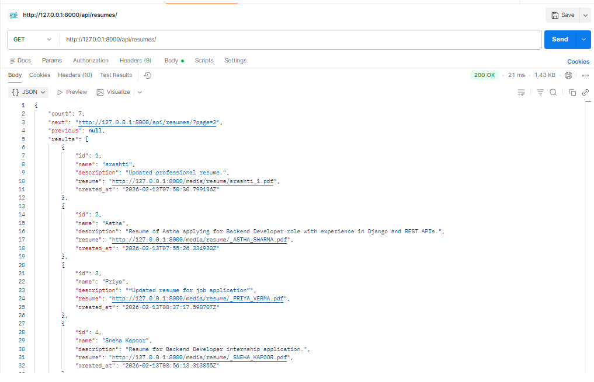
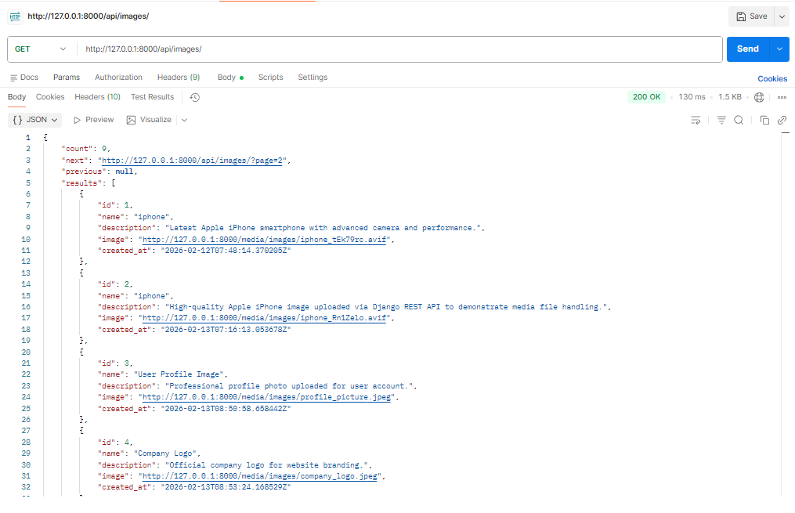

🗂 Django REST File Upload API

A production-ready Django REST Framework API for uploading and managing Images and Resume files with proper media handling, filtering, and full CRUD operations.

This project demonstrates clean API architecture, structured media storage, and professional documentation suitable for portfolio and backend development practice.

##🚀 Features

📤 Upload Images and Resume files

📂 Organized media storage (media/images/, media/resumes/)

🔎 Filter records by name

📄 Retrieve file lists and detail views

🔄 Full CRUD support (POST, GET, PATCH, DELETE)

🌐 Django Browsable API support

🧪 Tested using Postman

📸 Well-documented with screenshots

##📋 Requirements

Python 3.10+

Django 4+

Django REST Framework

Virtual Environment (recommended)

##⚙️ Installation & Setup
1️⃣ Clone the Repository
git clone https://github.com/srashtisikarwar/django-fileupload-api.git
cd django-fileupload-api

(Optional – clone into custom folder)

git clone https://github.com/srashtisikarwar/django-fileupload-api.git fileupload
cd fileupload

2️⃣ Create Virtual Environment
python -m venv env

Activate environment:

Linux / macOS

source env/bin/activate

Windows

env\Scripts\activate

3️⃣ Install Dependencies
pip install -r requirements.txt

4️⃣ Apply Migrations
python manage.py makemigrations
python manage.py migrate

5️⃣ Run Development Server
python manage.py runserver

Server will start at:

http://127.0.0.1:8000/

##📁 Project Structure
project_root/
│
├── upload/               # Django app
│   ├── models.py
│   ├── views.py
│   ├── serializers.py
│
├── media/                # Uploaded files
│   ├── images/
│   └── resumes/
│
├── screenshots/          # Project screenshots
│   ├── browser/
│   └── postman/
│
├── manage.py
└── README.md

##🌐 API Endpoints
Images
POST   /api/images/
GET    /api/images/
GET    /api/images/<id>/
PATCH  /api/images/<id>/
DELETE /api/images/<id>/

Resumes
POST   /api/resumes/
GET    /api/resumes/
GET    /api/resumes/<id>/
PATCH  /api/resumes/<id>/
DELETE /api/resumes/<id>/

##🧪 Example POST Request (Postman)

Body → form-data

Key	Type	Example
name	Text	iPhone 15 Pro
description	Text	High-resolution product image
image / resume	File	Select file

📦 Sample JSON Response
{
    "id": 9,
    "name": "Apple iPhone 15 Pro",
    "description": "High-resolution product image uploaded via Django REST Framework API",
    "image": "http://127.0.0.1:8000/media/images/Apple_iPhone_15_Pro.jpeg",
    "created_at": "2026-02-13T10:20:11.197567Z"
}

## 📸 API Testing Screenshots

### 🌐 Browser Testing (Django Browsable API)

## 🌐 Browser Testing (Django Browsable API)

### API Overview
- **API Root**
  

- **Image List Endpoint**
  

- **Resume List Endpoint**
  

- **Resume Detail View**
  

### 🧪 Postman Testing

#### 📤 Image Upload (POST)

#### 📄 Resume Upload (POST)

#### 📋 Resume List (GET)

#### 🖼 Image List (GET)

